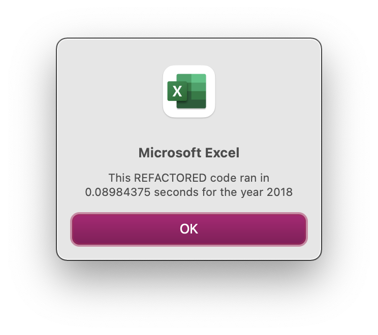

# stock-analysis

## Overview of Project
Steve wants to provide his parents an overview of many stocks, including DAQO, so he can help them make an informed decision across the green energy sector.

### Purpose
This project was created to provide an **efficient** evaluation of all green energy stocks. The evaluation compares 2017 and 2018 performance. It includes his parent's target company: DAQO New Energy Corporation (ticker: DQ), as well as other green energy stocks.

## Results
### Stock Evaluation
Starting with the results of the stock evaluation, the following images show both 2017 and 2018 performance:

     

While most stocks performed well in 2017, the following year was a definite challenge. 
* Only two stocks, ENPH and RUN, have positive annual performance each year. 
* Steve's parents are focusing on DQ which had incredible returns in 2017 (199.4%) but negative returns in 2018 (-62.6%).

### Script Performance
Next, the script performance was greatly improved once the code was refactored. The following images compare the original script with the refactored script:
#### 2017 Performance Improvement of 74.7%:
  
#### 2018 Performance Improvement of 80.4%:
  

## Summary
Refactoring code can provide advantages and disadvantages.
### Advantages
* Performance improvement - Consolidating statements within a code block reduces access time.
* Maintainability - Leveraging reference variables in code helps to only update ONCE when code changes are needed.
* Readability - Adding proper comments inside the code blocks helps the reader understand the intent of the code.

### Disadvantages
* Time - It is difficult to predict how much time will be needed to refactor, especially if the person is NOT the author of the original code.
* Impact - Unintended consequences of other programs/scripts who call the refactored can occur.
 

For this project, the following advantages and disadvantages were discovered:
### Advantages
* Performance greatly improved by refactoring.
* The code was easier to  use after the arrays were created and utilized.

### Disadvantages
* The time to refactor did take longer than predicted. 
* Code from other modules was required to be inserted in the refactored module which was not expected.
